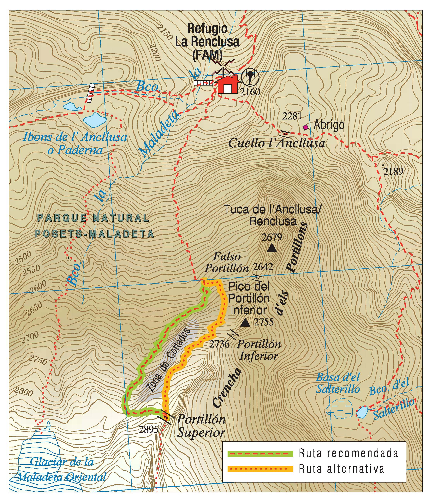

# Mapas: qué es un mapa (14 de 36)

**Un mapa es la representación de toda o una parte de la superficie terrestre sobre una superficie plana** (un papel). Además, también cumple que:

\- Es una representación **a escala** (sin conservar medidas reales).

\- Es una representación **resumida** (no se muestra toda la información, sólo la que para cada fin se considera relevante)

\- Es una representación **esquemática** (se utilizan diferentes simbologías para indicar informaciones tipo)

Existen **mapas de carreteras, mapas topográficos, mapas temáticos, mapas náuticos**, etc.

Para nosotros como federados, de entre todos los tipos de mapa que existen nos va a interesar el **mapa topográfico, que es la base de los mapas excursionistas** y **en ellos se muestra la información del relieve**, que para caminar por la montaña es fundamental.

