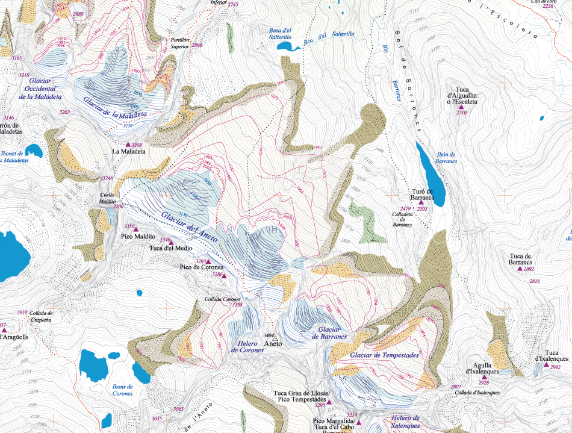

# Mapas: el mapa excursionista (15 de 36)

Los **mapas topográficos son la base de los mapas excursionistas**, que son a su vez aquéllos que necesitaremos para planificar y realizar nuestras actividades con seguridad.

Los mapas topográficos los realiza el **[Instituto Geográfico Nacional](http://www.ign.es/ign/main/index.do "Instituto Geográfico Nacional")** (IGN). Son de interés excursionista las [**escalas**](http://es.wikipedia.org/wiki/Escala_(cartograf%C3%ADa) "Escala en Wikipedia") **1:25.000 y 1:50.000**, aunque hay que tener muy presente que el IGN hace mapas sin finalidad excursionista, y que por lo tanto los caminos no siempre vienen reflejados en estos mapas, ni tampoco todos los refugios, los puentes, las fuentes, los abrigos, etc., información toda ella fundamental para el excursionista.

Sin embargo sí vienen provistos de una información altimétrica de gran interés, constituida por las **curvas de nivel**. 
