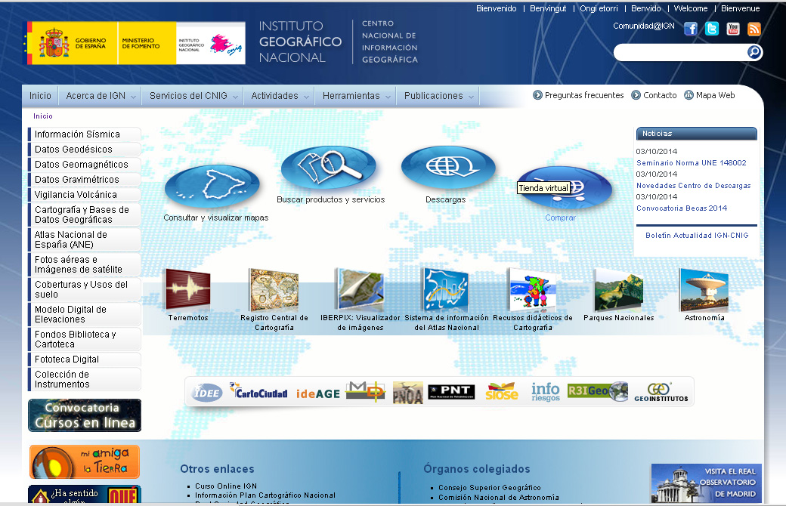

# Mapas: fuentes de mapas (16 de 36)

Tal como ya hemos comentado, el **IGN** es el encargado hoy en día de proveer toda la **cartografía de escalas 1:25.000 y 1:50.000** de España.

Esta cartografía es la base que utilizan el resto de las editoriales que se dedican a editar mapas excursionistas, enriqueciendo estas bases con información de interés excursionista y revisión toponímica.

Por lo tanto, si de una zona concreta no existen mapas excursionistas (hay más montañas que mapas, sin duda!), siempre puedes ir a buscar el mapa de escala adecuada a la fuente, el IGN, que a través de su [**Centro de Descargas**](http://centrodedescargas.cnig.es/CentroDescargas/index.jsp "Centro de Descargas IGN")  permite descargar la imagen de sus mapas de sus series MTN 25 ráster y MTN 50 ráster, siendo el valor numérico la escala de las series. Allí, **por hojas y de manera gratuita,** podrás descargar estas imágenes y utilizarlas como necesites (los formatos de descarga son **[Tiff](http://es.wikipedia.org/wiki/TIFF "Tiff en Wikipedia")** o **[Ecw](http://es.wikipedia.org/wiki/Enhanced_Compressed_Wavelet "ECW en Wikipedia")**).

Para proveerte de mapas excursionistas, preparados especialmente para una finalidad excursionista, tendrás que dirigirte a las distintas editoriales que se dedican a ello. Las 4 principales editoriales que tienen mapas de la **montaña aragonesa** son las siguientes (aunque hay otras):

*   [Editorial Alpina](http://www.editorialalpina.com/ "Editorial Alpina")
*   [Editorial Pirineo](http://www.editorialpirineo.com/ "Editorial Pirineo")
*   [Editorial Prames](http://www.prames.com/homepage.asp "Editorial Prames")
*   [Editorial Sua](http://www.sua-ediciones.com/ "Editorial Sua")

Te recomendamos que intentes tener siempre **un mapa actualizado** (de una versión reciente, todos los mapas llevan el año de la edición o de la reedición) y de una escala entre 1:25.000 y 1:40.000, aunque es **más recomendable la 25.000**.

