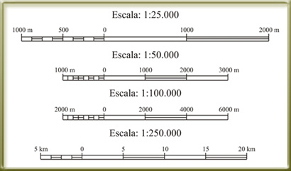

# Elementos del mapa: la escala (18 de 36)

La [**escala de un mapa**](http://es.wikipedia.org/wiki/Escala_(cartograf%C3%ADa) "Escala del mapa") es la **relación que existe entre las dimensiones del mapa y las dimensiones reales** del elemento que representa.

Ya hemos hablado antes de la escala, diciendo que la 1:25.000 era mejor que la 1:50.000 porque ofrecía más detalle, etc., ¿pero sabemos realmente lo que significa?

**Escala 1:25.000** se lee, literalmente: **_1 cm (metro, km...) del mapa, representa 25.000 cm (metro, km...) de la realidad_**, o lo que es lo mismo, **_1 cm del mapa representa 250 m de la realidad._**

Es sencillo, ¿no? Normalmente en alguna esquina del mapa suele aparecer la escala tal como la hemos visto ahora, del tipo 1:25.000 (llamada también **escala numérica**) acompañada de una barra que indica distancias, esa es la **escala gráfica**, y por supuesto las dos indican lo mismo, la relación entre distancia en el mapa y la distancia en la realidad.

Es muy importante tener clara la escala del mapa, puesto que ello nos da idea de la distancia real que hay hasta un lugar, o la longitud del camino.

