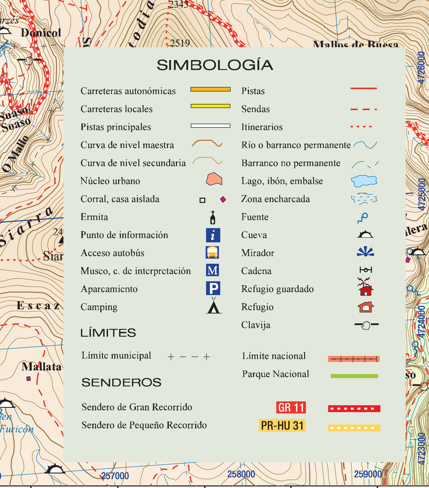

# Elementos del mapa: la leyenda I (19 de 36)

Todos los mapas llevan, o por lo menos deben llevar, **una leyenda**.

La leyenda, que permite interpretar bien el mapa, está compuesta por dos tipos de información principal:  

-** Información de los elementos dibujados** en el mapa

\- **Información de la georreferencia** del mapa

La **información de los elementos dibujados** en el mapa es la **traducción entre la simbología utilizada en el mapa y el elemento que representa en el mundo real.**

En esta imagen puede verse un ejemplo de simbología, en ella están contemplados los siguientes elementos, habituales en un mapa excursionista:

*   Simbología de las **carreteras** (locales, nacionales, autonómicas, etc.)
*   Simbología de las **pistas forestales**
*   Simbología de distintos **tipos de caminos** (según su definición, su anchura, su facilidad para seguirlos...)
*   Simbología de las **curvas de nivel**
*   Simbología de **elementos de agua**: ríos, canales, embalses, ibones...
*   Simbología de **elementos de construcciones**: poblaciones, casas, casas en ruinas, casas aisladas...
*   Simbología de **elementos puntuales relevantes**: iglesias, fuentes, refugios, oficinas de información turística, museos, cadenas en pistas, cuevas, miradores, clavijas en pasos de montaña...
*   Simbología de **límites**: país, comunidad autónoma, municipio, espacio natural protegido...
*   Simbología de **caminos señalizados**: senderos de Gran Recorrido (GR), de Pequeño Recorrido (PR), de Espacio Natural Protegido... siempre con su numeración oficial

En resumen, esta parte de la leyenda es un **diccionario del mapa**, aquello que nos permite comprender, "leer", el mapa y asociarlo (reconocerlo) con la realidad.