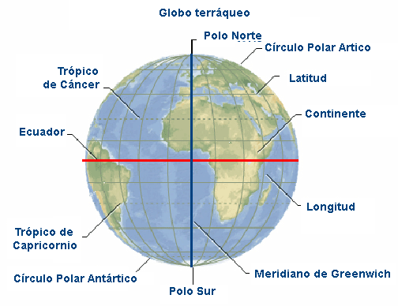

# La tierra: los polos y el ecuador (2 de 36)

El **eje polar** es un eje imaginario que atraviesa la tierra de arriba abajo, pasando por el centro del planeta y también por el **Polo Norte y el Polo Sur**. Sobre este eje la tierra gira realizando un movimiento de rotación completa cada 24 horas.  

El **eje ecuatorial** es un eje perpendicular al anterior, que se cruza con este en el centro del planeta. El **plano ecuatorial**, que contiene al eje ecuatorial, divide al planeta en dos partes iguales: los **hemisferios norte y sur**. La intersección de este plano sobre la superficie terrestre es el **ecuador**, un anillo que rodea el planeta por su parte más ancha.

