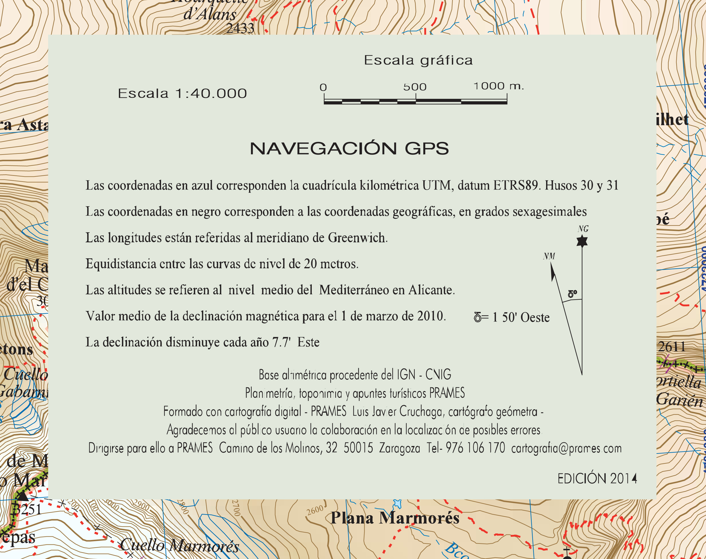

# Elementos del mapa: la leyenda II (20 de 36)

La otra parte de la leyenda hace referencia a la **Información de la georreferencia** **del mapa**y otros datos.

En la imagen aparece un ejemplo tipo, en él podemos ver datos del tipo:

\- **Escala gráfica y numérica**

\- **Sistema de referencia** al que hacen referencia las coordenadas del borde del mapa (sistema de proyección, Datum y Huso si es proyección UTM)

\- **Equidistancia de las curvas de nivel**

\- **Cota cero** a la que se refieren las altitudes de las curvas de nivel y cotas

\- Valor de la [**declinación magnética**](http://es.wikipedia.org/wiki/Declinaci%C3%B3n_magn%C3%A9tica "Declinación magnética en Wikipedia") para el mapa (relación entre el norte geográfico del mapa y el norte magnético que marca la brújula)

\- **Otros datos de la publicación**, editorial, año de actualización, etc.

