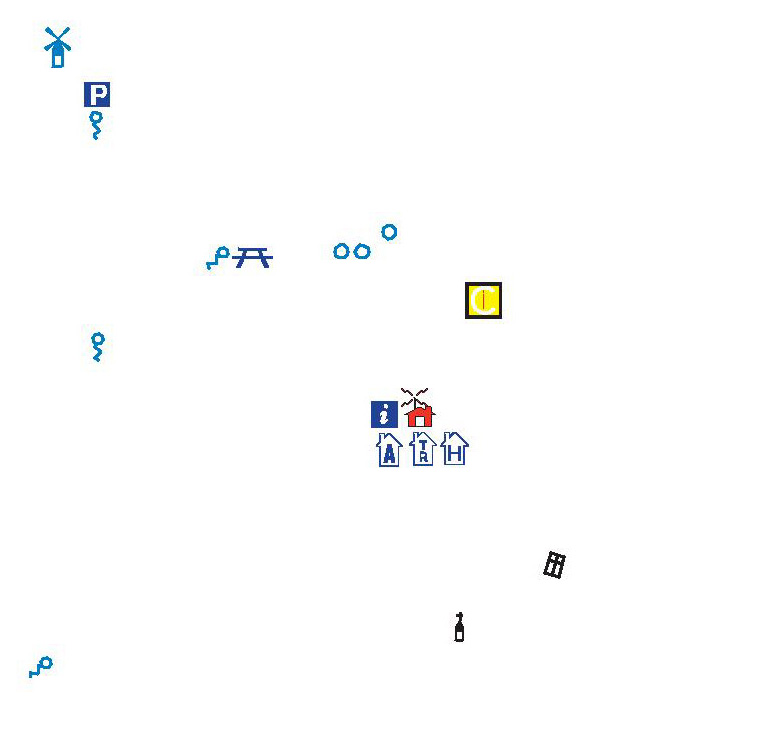

# Elementos del mapa: los iconos (25 de 36)

El mapa también contiene información que se representa mediante **iconos** por tratarse de elementos que en la realidad son muy pequeños pero que por **importancia excursionista** requieren aparecer de manera destacada.

Estos iconos pueden ser de varios tipos, pero normalmente tienen en común que intentan posicionarse sobre el elemento real mediante unos **dibujos y/o colores que llamen la atención**.

De esta manera en mapas excursionistas suelen aparecer señalizados mediante iconos los siguientes elementos:

\- **Fuentes**

\- **Refugios**: guardados, sin guardar, con o sin radio socorro

\- **Puentes** en caminos y cadenas en pistas de acceso

\- **Picos, collados, miradores**...

\- **Servicios varios**: museos, puntos de información turística, aparcamientos...

\- **Ermitas e iglesias** de distinta relevancia

Así, mediante iconos se suelen representar...