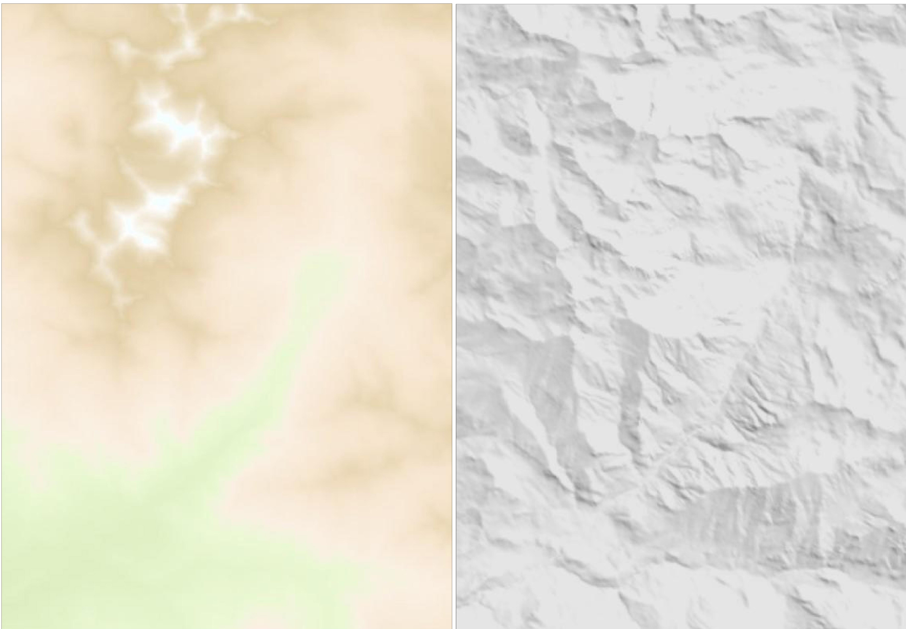

# Elementos del mapa: el fondo del mapa (26 de 36)

El **fondo del mapa** habitualmente es una imagen de color que intenta aportar más información al propio mapa. Puede haber fondos de varios tipos, pero en los mapas excursionistas tres son los más utilizados:

\- Fondo de **altimetría**: El fondo altimétrico es **una imagen que a cada altitud o rango de altitudes le corresponde un color**. El más habitual es el de fondo de los **valles en verde**, a medida que se gana en altitud virar el verde a un crema y después **marrón** y **terminar las cimas**, si son altas (zonas de 3.000, con nieve habitual en invierno) **con un color blanco**. Ello permite **identificar rápidamente los** **fondos de los valles**, las cotas bajas, **y las cimas**, las cotas altas, sin tener que mirar los valores de cotas o de cimas. 

\- Fondo de **sombreado**: El fondo sombreado es un **fondo monocolor** (escala de grises) que asemeja a la **imagen del relieve iluminada** por un foco con una perspectiva **similar a la del sol**. Es menos intuitivo que el anterior, pero suele permitir destacar más el resto de la información del mapa al no aportar una base de color a todo el mapa. Permite ver relieves, pero para saber si se trata de cimas o valles hay que fijarse en algo más que el fondo de color.

\- Fondo de **vegetación**: El fondo de vegetación habitualmente simboliza de manera muy **resumida el tipo de terreno por el que nos vamos a mover**, diferenciando si se trata de bosque, zona arbustiva (poca sombra), prados o parajes rocosos. Un vistazo a simple vista no permite reconocer valles y cimas, aunque tampoco es ese su objetivo. **Su objetivo es aportar un plus de información**, que en ocasiones puede ser de gran valor, sobre el terreno de montaña, puesto que no es lo mismo un recorrido por bosque que por una ladera rocosa. Suele ser un fondo que los excursionistas más avezados saben interpretar de manera rápida, aunque a los menos habituales les suele confundir más.

El fondo del mapa...