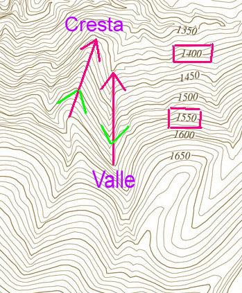

# Las curvas de nivel: lo que dicen I (27 de 36)

Las [**curvas de nivel**](http://es.wikipedia.org/wiki/Curva_de_nivel "Curvas de nivel en Wikipedia"), esa parte del mapa que constituye la altimetría, que nos habla de la tercera dimensión del terreno, nos dicen muchas cosas, pero **hay que saber leerlas correctamente**.

Para conocer datos de nuestra excursión será necesario dedicar un rato al mapa y saber interpretar lo que éste dice, sobre todo en lo que hace referencia a las altitudes.

La primera información que nos proporcionan las **curvas de nivel** es la **situación de valles y divisorias**. La **forma de las curvas en el mapa en ambos casos es la misma**, allí donde **las líneas dibujan una U o una V se encuentra la parte más alta (divisoria) o más baja (valle) del relieve**, pero la diferencia está en que:

\- En el caso de los valles la punta de la flecha que une alturas en descenso forma una V contraria a la V de las curvas

\- En el caso de las divisorias la punta de la flecha que une alturas en descenso  forma una V paralela a la V de las curvas

En la **imagen** se puede ver, tomando la línea que una las cotas 1550 y 1400 en descenso, que eso es así: la flecha del valle marca una V contraria a la V de las curvas de nivel y la flecha de la cresta marca una V paralela a la V de las curvas de nivel.  

Esta comprobación no será necesaria hacerla siempre, enseguida el ojo se acostumbra a leer los relieves y la localización de valles y divisorias de hace más intuitiva. También el fondo de color, si es de tipo hipsométrico, puede ayudar.

#### De la lectura de las curvas de nivel se puede extraer...