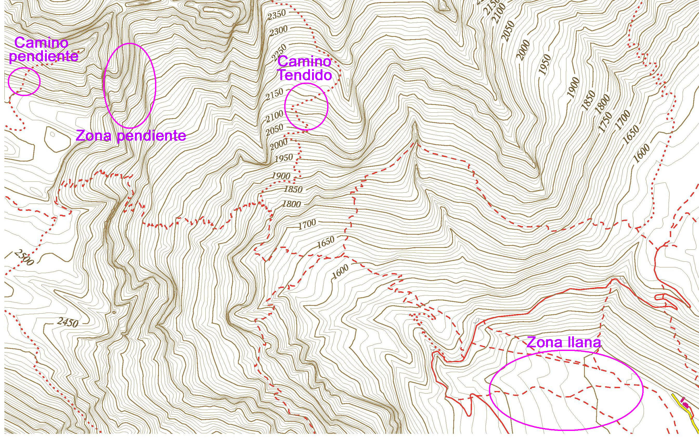

# Las curvas de nivel: lo que dicen II (28 de 36)

De la **lectura correcta de las curvas de nivel** también se puede obtener otra información importante: **la pendiente del terreno**.

\- **Curvas de nivel muy juntas indican fuertes pendientes** (puesto que en muy poca distancia horizontal -centímetros de mapa- se suben o bajan muchos metros en vertical -se atraviesan muchas curvas de nivel-)

\- **Curvas de nivel muy separadas indican zonas llanas o de suave pendiente** (puesto que en mucha distancia -centímetros de mapa- se suben o bajan muy pocos metros en vertical -se atraviesan muy pocas curvas de nivel-)

No es que sea necesario conocer la pendiente en cada tramo de un recorrido, pero sí conviene saber **qué tipo de terrenos vamos a pisar**.

Si las **curvas están muy muy juntas**, tan juntas que casi no puedes distinguir una de otra, estaremos hablando de un **cortado o pared vertical**. Los caminos difícilmente superan este tipo de terrenos, y en ocasiones cuando lo hacen se requiere del uso de las manos o agarrarse a clavijas y cadenas (que también deberían venir indicadas en el mapa con su propio icono).

Tan importante como comprender correctamente la pendiente del terreno en el recorrido de la excursión es **comprender qué hace el camino en relación al terreno**:

*   Cuando **el camino corta las curvas de nivel de manera perpendicular** significa que el camino sube de manera directa la pendiente (va cara a la pendiente), y por lo tanto si se trata de un terreno de fuerte pendiente será un camino de exigente ascenso.
*   Cuando **el camino corta las curvas de nivel de manera oblicua**, haciendo continuas lazadas en el terreno para evitar la máxima pendiente, y el terreno es de fuerte pendiente será un camino de más fácil ascenso, pues su trazado intenta evitar la máxima pendiente y suavizar el ascenso con más centímetros sobre el mapa de camino (que al final son más metros sobre el terreno de camino).

De esta manera comprendemos no solo el relieve, sino qué hará nuestro itinerario para superarlo.

#### De las curvas de nivel se puede extraer la siguiente información.