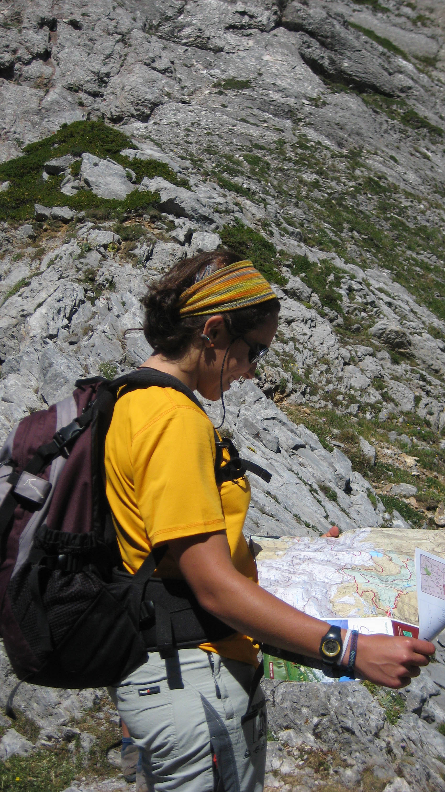

# Leer el mapa (29 de 36)

Como has podido ver hasta ahora, **leer un mapa es como leer un libro: hay que prestar atención y comprender bien su simbología para asegurarnos una buena interpretación del terreno real** que representa el mapa.

Sin embargo, no todo la realidad puede verse volcada en un papel, por lo que también hay que tener en cuenta que a esa versión simplificada del mundo le puede estar faltando información relevante. O lo que es lo mismo, debemos tomar el mapa como una herramienta que nos permita interpretar el mundo, la montaña, pero no como una verdad absoluta: lo que es real es el mundo, no el mapa.

Y mal que nos pese, ¡los mapas a veces se equivocan! O el mundo es más dinámico que un mapa, y donde hace tres años había un puente la riada de la pasada primavera resulta que se lo ha llevado...y así con mucha información...
