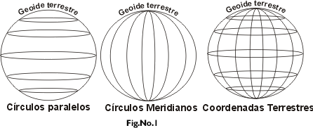

# La Tierra: paralelos y meridianos, latitud y longitud (3 de 36)

La tierra puede ser cortada por **cualquier plano que sea paralelo al plano ecuatorial.** La intersección de estos planos paralelos con la superficie terrestre recibe el nombre de **paralelos**.

El ecuador es el paralelo de mayor longitud, a medida que los planos paralelos se acercan a los polos los paralelos resultantes son elipses cada vez más pequeñas.

Para nombrar a los **paralelos se usa una medida angular llamada latitud**. Esta hace referencia al ángulo del arco que forma el paralelo con el eje ecuatorial.  

El ecuador corresponde a un ángulo de 0 grados. A medida que nos desplazamos hacia los polos ese valor aumenta hasta un ángulo máximo de 90 grados. Para diferenciar un polo de otro, a los paralelos del hemisferio norte se les añade una N detrás, y a los del hemisferio sur una S.  

**Todo punto tiene una latitud, que es el ángulo, N o S, que hace el paralelo que pasa por ese punto con el plano ecuatorial, en valores que van de 0 a 90º.**  

A cualquier **plano que contienen el eje polar y que corta con el planeta tierra se le llama plano meridiano**. Son planos perpendiculares al plano ecuatorial. La intersección del plano meridiano con la superficie terrestre genera una elipse llamada **meridiano**.  

Aunque a lo largo de la historia se han tomado varios meridianos como referencia, cada país el suyo, ahora mismo hay **un meridiano considerado 0 de manera internacional: el meridiano de Greenwich**, que además pasa por Aragón.  

Los meridianos se nombran mediante el ángulo que forman con el meridiano cero o de Greenwich. A este ángulo se le llama longitud. Si el meridiano está a la derecha de Greenwich se establece una longitud Este (E), y si está a la izquierda una longitud Oeste (W), hasta un valor máximo, en ambos casos, de 180º (180º al este es igual que 180º al oeste, y es el meridiano que forma elipse con el de Greenwich).  

**Todo punto tiene una longitud, que es el ángulo, E o W, que hace el meridiano que pasa por ese punto con el meridiano cero o de Greenwich, en valores que van de 0 a 180.**
