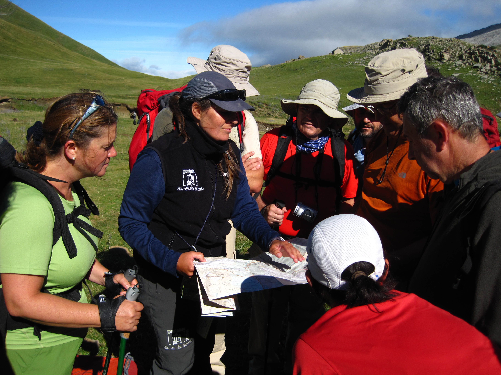

# Seguridad en montaña y mapa (30 de 36)

Sin duda, **muchos de los accidentes y rescates de los que se producen en montaña podrían evitarse si llevasemos y utilizasemos de manera habitual un mapa excursionista**.

Como **federados** ésta tiene que ser nuestra consigna a la hora de preparar y llevar a cabo una actividad.  

Desde la campaña **Montaña Segura** se han **editado bastantes mapas excursionistas**, que se pueden conseguir **de forma gratuita en puntos de la Red de Informadores Voluntarios**. De todas formas, conviene que tengáis mapas excursionistas de las zonas sobre las que normalmente os movéis para diseñar los recorridos sobre un mapa, y acostumbrarse a "leer" la excursión sobre un mapa. Y que os animéis a compraros y llevar un mapa.

La **vieja frase** de que la gente, **los senderistas no saben leer un mapa** (no suele pasar así con los montañeros) y que por ello no merece la pena intentarlo debéis desterrarla de vuestra cabeza: **leer un mapa requiere tiempo** (educación) **y costumbre**, y si nunca empezamos nunca sabremos.  

#### Como federado de montaña debes concienciarnte de que...