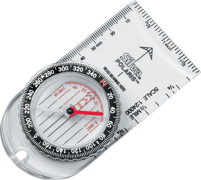

# La brújula (31 de 36)

Sin duda, el complemento imprescindible para un mapa es la [**brújula**](http://es.wikipedia.org/wiki/Br%C3%BAjula "Brújula en Wikipedia").

Es cierto que un determinado número de **excursionistas o montañeros sí llevan mapa**. Si nos referimos a la **brújula ese número disminuirá considerablemente**...

Sin embargo, **la brújula es la única herramienta que te permite orientar el mapa con garantías**, y a partir de ahí hacer una lectura correcta del mismo, comparándolo con la realidad.

**En este curso no vamos a dar una lección de cómo orientar un mapa**, y aunque es una tarea que no es difícil requiere su práctica. Si no sabéis hacerlo, en internet encontraréis múltiples vídeos de cómo hacerlo, aunque tened en cuenta las siguientes consideraciones:

*   Los mapas siempre van "cortados" de tal manera que **los bordes verticales son líneas norte-sur**, la misma que marca la aguja imantada de una brújula
*   **Será necesario orientar el mapa correctamente siempre que queramos compararlo con la realidad** (comparar una cosa con la otra). Cuando estamos en casa no es necesario orientar el mapa
*   El concepto de **"[declinación magnética](http://es.wikipedia.org/wiki/Declinaci%C3%B3n_magn%C3%A9tica "Declinación magnética en Wikipedia")"** indica una **diferencia entre el norte geográfico del mapa y norte magnético de la brújula,** que en nuestras latitudes no suele ser significativo pero que sí hay que tener muy en cuenta si nos vamos a zonas cercanas a los polos. En la leyenda del mapa está la fórmula que permite equiparar uno y otro norte

El uso de **mapa + brújula** sobre el terreno permitirá, **mediante triangulación**, **dos maniobras de gran interés**:

*   **Conocer nuestra posición exacta a partir de tres posiciones conocidas** que veamos sobre el terreno y sobre el mapa
*   **Conocer el nombre de cualquier pico o cima** siempre que conozcamos nuestra posición sobre el mapa y el pico salga en el mismo

Para aprender a utilizar la brújula con el mapa conviene dedicarle tiempo y "jugar" de vez en cuando a orientar el mapa y reconocer lugares o precisar nuestra ubicación a partir de lugares conocidos. Eso, sí, siempre en el medio, en el monte.
