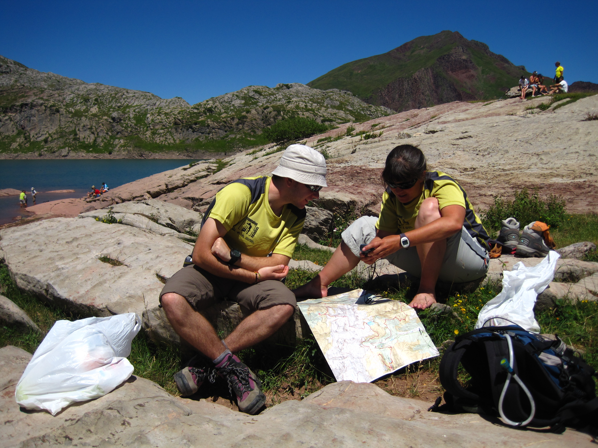

# Los principales errores de los senderistas (33 de 36)

**El colectivo de senderistas, o excursionistas de baja dificultad no suelen llevar casi nunca mapa,** a pesar de que sin duda alguna desde Montaña Segura consideramos que casi siempre deberían.

De hecho, **un importante número de rescates de los que se producen a este colectivo se podrían fácilmente evitar** **llevado un mapa** y haciendo una correcta interpretación del mismo, estamos hablando de **extravíos y agotamientos**.

Es por ello que siempre insistimos en que **como federados debéis intentar realizar vuestras actividades con un mapa**, de manera que os vayáis acostumbrando y aprendiendo a usarlo, porque el mapa no sólo lleva la excursión que vamos a realizar, sino también la información de todo el entorno, las alternativas, y el terreno en el que nos perdemos, llegado el caso...

Un mapa vale poco dinero y dura bastante tiempo, es sin duda una inversión en seguridad y en cultura de montaña.

#### Como federado debes saber que...