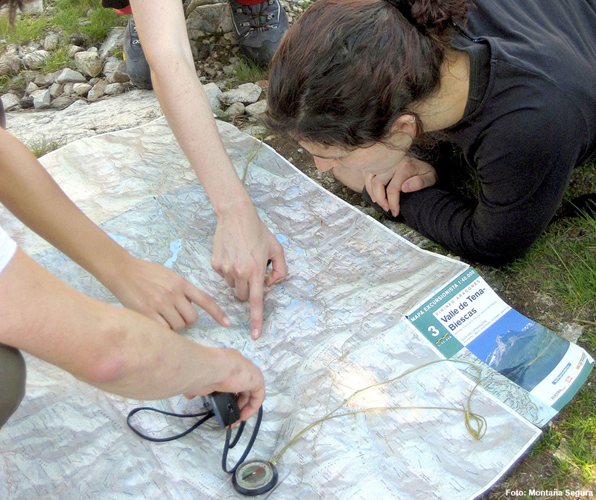

# ¡Felicidades: estás a punto de terminar el curso! (36 de 36)

  

Te damos la enhorabuena por ello y te agradecemos el esfuerzo y el tiempo que le has dedicado.

Esperamos que te haya sido provechoso y te animamos a que nos comentes tus impresiones o nos aportes comentarios para que podamos mejorar. **¡No olvides darle a "fin de la lección" para que el curso se considere finalizado!**  

Recuerda que entre todos podemos aprender el **correcto y habitual uso de mapas en montaña**, y que vuestro papel de **federado** es fundamental para ello.

#### ¡Muchas gracias y hasta pronto!

#### Montaña Segura