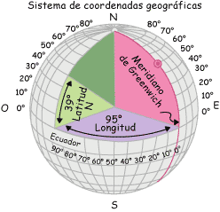

# La tierra: coordenadas geográficas (4 de 36)

**Por cada punto existente sobre la esfera terrestre pasa un único paralelo y un único meridiano**. La latitud de ese paralelo y la longitud de ese meridiano definen, por tanto, el punto de una manera única.  

Los valores de latitud y longitud para definir un punto son las **coordenadas geográficas** del mismo. No hay dos puntos sobre el planeta que tengan las mismas coordenadas, aunque debemos recordar que estos valores numéricos deben ir siempre acompañados de su letra correspondiente, N y S para la latitud y E y W para la longitud.  

