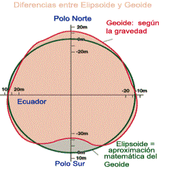

# La tierra: elipsoide de referencia (5 de 36)

La tierra de todas maneras no es regular como una forma geométrica, por lo que no resulta tan sencillo aplicarle fórmulas matemáticas para conocer las coordenadas de un punto.  

En general **se ha preferido utilizar un elipsoide de referencia** para trabajar de manera matemática con él, aunque cada país tiene su propio elipsoide de referencia, ese que mejor encaja en su zona, y sigue siendo en todo caso una medida aproximada. **La cartografía de España trabaja actualmente, y por normativa europea, con el elipsoide GRS 80.** Hasta hace poco se trabajaba con el Elipsoide de Hayford o Internacional, pero eso ha cambiado en los últimos años, aunque muchos mapas impresos, si son de hace algún tiempo, utilizan este sistema de referencia.  

No hay que olvidar que se está siempre trabajando con formas ideales que permitan cálculos sencillos, pero la tierra es algo mucho más complejo. Sólo hay que pensar que además de la forma de la tierra está el relieve, **las montañas sobre los continentes,** algo que todavía hace que la realidad se aleje más de la teoría.  

