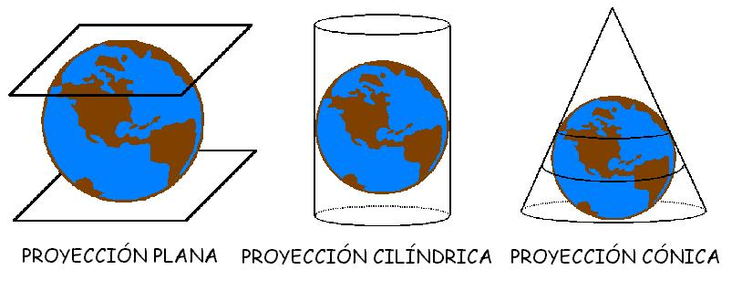

# Proyecciones: qué es una proyección (6 de 36)

  

Una **proyección** es la "sombra" que hace **un objeto de tres dimensiones** (la tierra, o una parte de la misma) **sobre otro de dos dimensiones** (un papel). En el proceso de proyectar se pierde información de esta tercera dimensión, **la altura**, aunque hay sistemas para "recuperar" este tipo de información y plasmarla sobre el plano proyectado (como es, en los mapas topográficos, las curvas de nivel para representar altitudes).

Existen **tres tipos de proyección** básicos, en función de donde "pongamos el papel" con referencia al objeto de tres dimensiones que queremos proyectar: **la proyección plana, la cilíndrica y la cónica.**En la imagen puede verse cómo se pondría el papel en cada caso.  

La **cartografía topográfica existente en España y Europa, que es la base de la cartografía excursionista, utiliza una proyección cilíndrica** por ser la que mejor se ajusta a la realidad de las latitudes cercanas al ecuador y medias. Para latitudes cercanas a los polos se utilizan proyecciones cónicas.
