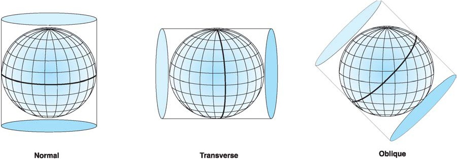

# Proyecciones: proyección cilíndrica (7 de 36)

La **proyección cilíndrica** se basa en un cilindro que se coloca tangente (tocando) a la superficie terrestre en un anillo. Las superficies y elementos se representan muy bien en la zona que toca el cilindro y la tierra, pero a medida que nos alejamos de la línea tangente van aumentando las distorsiones.

Dependiendo de en qué manera se coloque el cilindro con respecto a la esfera terrestre tiene distinto nombre.

Una **proyección cilíndrica normal** tiene el eje del cilindro coincidente con el polar, y es tangente al ecuador por lo que esa es la parte que mejor se representa.

Una **proyección cilíndrica transversa** tiene el eje del cilindro perpendicular al eje polar, y es tangente a un meridiano.

Una **proyección cilíndrica oblicua** tiene el eje del cilindro en una posición intermedia entre la normal y la transversa.

